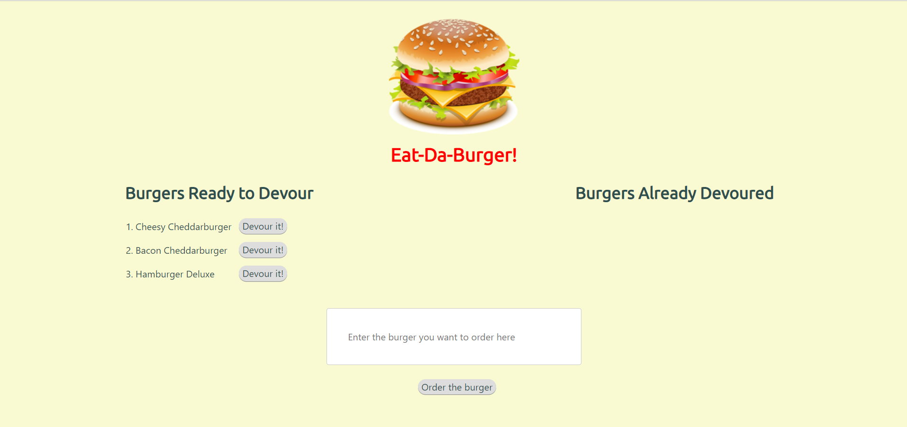

# Eat-Da-Burger!

The goal was to create a Burger App with MySQL, Node, Express, Handlebars and a homemade ORM. It uses the MVC design pattern; use Node and MySQL to query and route data to the app, and Handlebars to generate the HTML.

## Getting Started

1. Please clone repo into your computer
2. Run npm install in GitBash
3. Create database MySQL database with provided schema and seeds
4. Run ```node server.js``` in the command line while in the appropriate directory

## Demo
	
*Eat-Da-Burger* is deployed to Heroku. Please check it out [here](https://guarded-inlet-27004.herokuapp.com/)

## Screen Shots
Main Page <br>


## Technologies used

- Node.js
- MySQL
- body-parser NPM Package - https://www.npmjs.com/package/body-parser
- express NPM Package - https://www.npmjs.com/package/express
- mysql NPM Package - https://www.npmjs.com/package/mysql
- express-handlbars NPM Package - https://www.npmjs.com/package/express-handlebars

